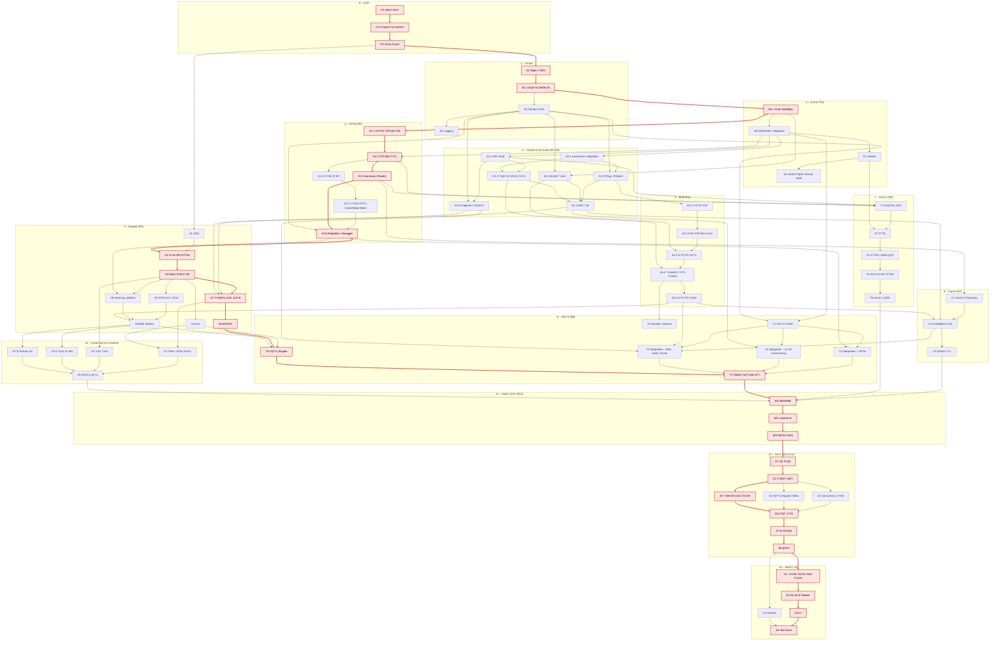

# תכנון עבודה וחלוקה למשימות

## 1. דרישות המבדק (מזהים)

| מזהה | דרישה |
|---|---|
| R1 | שליפה: Pagination, סינון משולב, חיפוש טקסט, מיון, Aggregations, Validation, CancellationToken, DTOs |
| R2 | עדכון סטטוס: 404, Validation, מעברים מותרים, Optimistic Concurrency, UpdatedAt/RowVersion, מניעת Lost Update |
| R3 | היסטוריית שינויים (Audit) + Endpoint |
| R4 | Bulk עד 100 פניות + התנהגות בכשל חלקי |
| R5 | Angular: פעולות בצד השרת, Debounce, ביטול בקשות, Loading/Empty/Error, 409, Aggregations, היסטוריה, הפרדת אחריות |
| R6 | ביצועים על 100K: Plan, אינדקסים, Bottleneck |
| R7 | Cache: Expiration, Invalidation, נימוק, ריבוי מופעים |
| R8 | ≥4 בדיקות אוטומטיות, כולל Integration ו-Concurrency |
| R9 | תכנון עבודה |
| R10 | איכות קוד: מבנה, DI, Async, שגיאות, Validation, Logging |
| R11 | תיעוד |
| D | ≥100K רשומות, יצירה חוזרת |

## 2. החלטות מרכזיות

| # | נושא | החלטה | נימוק |
|---|---|---|
| 1 | מבנה | 3 פרויקטים: Api / Application / Infrastructure + שכבת Services ב-Application | הקומפיילר אוכף את כיוון התלויות; ה-Services מחזיקים את הלוגיקה (מעברים, Audit, Bulk, Cache) כך שה-Repository נשאר גישה לנתונים בלבד |
| 2 | העברת גרסה | עדכון בודד: `ETag` + `If-Match` (חסר → 428, `*`/פגום → 400). Bulk: `rowVersion` לכל פריט בגוף | `If-Match` הוא המנגנון הסטנדרטי של HTTP לעדכון מותנה; ב-Bulk Header אחד לא יכול לשאת 100 גרסאות |
| 3 | 409 | גוף עם `currentState` + `lastChange` (מי ומתי, מה-Audit); דיאלוג "רענון" / "ניסיון חוזר" | 409 עם המצב הנוכחי חוסך ללקוח בקשה נוספת; ה-Audit מאפשר לומר גם מי שינה. ההחלטה מי מנצח נשארת אצל המשתמש |
| 4 | מעברי סטטוס | Workflow: New→InProgress/Waiting, InProgress→Waiting/Completed, Waiting→InProgress/Completed, Completed→InProgress | האפיון דורש "מעבר שאינו מותר" |
| 5 | Summary | Facets לפי הפילטר הנוכחי; Cache רק לתצוגה ללא פילטר. שדות: סה"כ, לפי סטטוס, לפי עדיפות, פתוחות מעל 7 ימים, עדכון אחרון, Top מטפלים | ספירה לפי שאר הפילטרים עונה על "מה יש בקטגוריות האחרות"; התצוגה ללא פילטר היא הנפוצה והיקרה ביותר ולכן היא שנשמרת ב-Cache |
| 6 | ממשק | עברית RTL + Angular Material; נתונים בעברית | קהל היעד דובר עברית; Material נותן רכיבים נגישים מוכנים (טבלה, דפדוף, דיאלוגים) |
| 7 | מצב סינון | מסונכרן ל-URL | רענון שומר את התצוגה, אפשר לשתף קישור, כפתור Back עובד |
| 8 | נתוני בדיקה | Seed אוטומטי בהרצה ראשונה + פקודת `seed` ליצירה חוזרת; Bogus עם Seed קבוע + SqlBulkCopy | הבודק לא צריך פקודה נוספת בהרצה ראשונה; האפיון דורש יצירה חוזרת |
| 9 | גרסאות | .NET 8 + EF Core 8; Angular 21 | נגישות לבודקים; Node הקיים |
| 10 | בדיקות | DB נפרד לכל מחלקת בדיקות; FluentAssertions 7 (נעול); תרחישי קצה בדפדוף, בחיפוש ובעדכון + Bulk/Audit/Cache | בידוד מלא והרצה מקבילית; Migration אמיתי נבדק; גרסה 8+ של FluentAssertions דורשת רישיון בתשלום |
| 11 | Repo | `src/` + `tests/`; `Directory.Build.props`, `.editorconfig`, `.gitattributes`, `nuget.config` | מבנה מקובל ב-.NET; הגדרות משותפות במקום אחד; סיומי שורה עקביים |

### החלטות שהתקבלו במהלך הביצוע

שאלות שעלו רק בזמן העבודה, ובחנתי אותן לפני שהמשכתי:

| משימה | נושא | החלטה | נימוק |
|---|---|---|
| S4 | כלל CA1848 (Logging) | `[LoggerMessage]` Source Generator | ללא boxing כשהרמה כבויה, נבדק בקומפילציה, רשימת אירועי לוג מרוכזת |
| A1.4 | מה ה-Repository מחזיר בקריאה | DTOs שמוטלים (Projection) בתוך ה-DB | Application לא תלוי ב-EF בכלל; סינון/מיון/דפדוף תמיד ב-SQL |
| D1 | שמות ארגונים | בדויים, מורכבים מחלקים | לא לייחס פניות/תלונות מומצאות לגופים אמיתיים |
| D1 | שמות מטפלים | שמות עבריים בדויים | טבעי בממשק בעברית |
| A1.2 | סינון לפי מטפל | חיפוש טקסט `contains` (שם פרטי או משפחה) | נוח למשתמש; העלות (Scan על אינדקס צר במקום Seek) נמדדת ב-F2 |
| U7 | הצגת פרטי פנייה | פאנל צד, מזהה הפנייה ב-URL | הרשימה נשארת גלויה; רענון/קישור/Back פותחים את אותה פנייה |

## 3. משימות

עמודות: **מזהה** · **משימה** · **מה נדרש** · **תוצר** · **תלוי ב-** · **שעות** (הערכה, שעות עבודה נטו) · **דרישה**. משימות שעל הנתיב הקריטי מסומנות ב-★.

### Epic 0 – תכנון

| מזהה | משימה | מה נדרש | תוצר | תלוי ב- | שעות | דרישה |
|---|---|---|---|---|---|---|
| P1 ★ | ניתוח האפיון | מיפוי הדרישות למזהים (סעיף 1); הנחות במקומות שהאפיון לא מגדיר: מעברי סטטוס, התנהגות Bulk בכשל חלקי | טבלת דרישות והנחות | – | 1.5 | R9 |
| P2 ★ | החלטות ארכיטקטורה | חלופות ונימוק לכל החלטה: מבנה שכבות, מנגנון Concurrency, קוד 409, Cache, Seed, גרסאות | סעיף 2 | P1 | 1.5 | R9, R10 |
| P3 ★ | תוכנית עבודה | פירוק למשימות, הערכות, תלויות, נתיב קריטי וסיכונים | `docs/WORK_PLAN.md` | P2 | 1 | R9 |

### Epic 1 – תשתית

| מזהה | משימה | מה נדרש | תוצר | תלוי ב- | שעות | דרישה |
|---|---|---|---|---|---|---|
| S1 ★ | Repo ותצורה | Solution עם `src/` + `tests/`; `Directory.Build.props` (.NET 8, Nullable, Analyzers, Warnings as errors); `.editorconfig`, `.gitattributes`, `nuget.config` | Repo שנבנה נקי | P3 | 1 | R10 |
| S2 ★ | שלושה פרויקטים ו-DI | Api / Application / Infrastructure; כיוון תלויות `Api → Application ← Infrastructure`; `AddApplication()` / `AddInfrastructure()`; Lifetimes | שלד שרץ | S1 | 1.5 | R10 |
| S3 | טיפול בשגיאות | `GlobalExceptionHandler`: 404 / 409 / 422 / 499 (ביטול) / 500 כ-Problem Details; Enums כשמות בשני ה-Serializers; בלי הודעות פנימיות של ה-JSON Parser | תשובות שגיאה אחידות | S2 | 2 | R10 |
| S4 | Logging | `[LoggerMessage]` לכל אירוע; רמות (Information לעדכון, Warning ל-4xx, Error לחריגה); מה לא נרשם (גופי בקשות, ערכים) | אירועי לוג מוגדרים | S3 | 1 | R10 |

### Epic 2 – מודל ונתונים

| מזהה | משימה | מה נדרש | תוצר | תלוי ב- | שעות | דרישה |
|---|---|---|---|---|---|---|
| M1 ★ | ישויות ו-Workflow | `ServiceRequest`, Status/Priority כ-`tinyint` עם ערכים מפורשים, `StatusTransitions` במקום אחד, אורכי שדות משותפים לוולידציה ולסכמה | מודל הדומיין | S2 | 2 | R2 |
| M2 | DbContext ו-Migration | Configurations, `datetime2(3)` ו-UTC Converter, טבלת היסטוריה עם FK, Migration ראשון | סכמה בבסיס הנתונים | M1 | 2 | R2, R3 |
| D1 | Seeder | Bogus עם Seed קבוע, ארגונים ומטפלים בדויים בעברית, התפלגות סטטוס/עדיפות/גיל; `SqlBulkCopy` במנות; בניית אינדקסים מחדש בסוף הטעינה | 100,000 פניות זהות בכל הרצה | M2 | 3 | D |
| D2 | Seed אוטומטי ופקודת `seed` | Seed כשהטבלה ריקה (Development); `dotnet run -- seed [count]` מוחק ויוצר מחדש; חסום ב-Production, 1–1,000,000, קוד יציאה בכישלון | הרצה ראשונה בלי צעד נוסף | D1 | 1 | D |

### Epic 3 – שליפה (R1)

| מזהה | משימה | מה נדרש | תוצר | תלוי ב- | שעות | דרישה |
|---|---|---|---|---|---|---|
| A1.1 ★ | מודל שאילתה וולידציה | `RequestSearchQuery`: גבולות `page`/`pageSize`, רשימה סגורה של שדות מיון, טווח תאריכים תקין, ערכי Enum חוקיים; 400 עם שם השדה | פרמטרים מאומתים | M1 | 2 | R1 |
| A1.2 ★ | בניית השאילתה | סינונים משולבים ב-AND; חיפוש "מכיל" בכותרת ובארגון; ארגון לפי תחילית; מטפל "מכיל"; Escape ל-`%`, `_`, `[`; מיון יציב עם `Id` כשובר שוויון | `RequestRepository.SearchAsync` | A1.1, M2 | 3 | R1 |
| A1.3 | דפדוף וספירה | `OFFSET/FETCH`; `COUNT` נפרד עם אותם סינונים; עמוד שאחרי הסוף – ריק בלי שאילתה; הגנה מגלישת Offset | `PagedResult` | A1.2 | 1.5 | R1 |
| A1.4 | הטלה ל-DTO ו-CancellationToken | Projection בתוך ה-SQL, `AsNoTracking`; `CancellationToken` מה-Controller עד EF | רק העמודות והעמוד הנדרשים יוצאים מה-DB | A1.3 | 1 | R1 |
| A1.5 ★ | Summary (Facets) | `GROUP BY (Status, Priority)` אחד לפי הסינונים; `byStatus` מתעלם מסינון הסטטוס ו-`byPriority` מסינון העדיפות; פתוחות מעל 7 ימים; עדכון אחרון; Top 5 מטפלים | `RequestSummaryService` | A1.2 | 3 | R1 |
| A1.6 ★ | Endpoints ו-Swagger | `GET /api/requests`, `GET /api/requests/summary`; Binding של ערכים מרובים (`?status=New&status=Waiting`); תיעוד קודים ב-Swagger | API לשליפה | A1.4, A1.5, S3 | 1 | R1, R11 |

### Epic 4 – עדכון סטטוס ו-Audit (R2, R3)

| מזהה | משימה | מה נדרש | תוצר | תלוי ב- | שעות | דרישה |
|---|---|---|---|---|---|---|
| A2.1 | `rowversion` ו-Migration | עמודת `rowversion` כ-Concurrency Token; הגדרת הגרסה הצפויה לפני השמירה; `UpdatedAt` מעוגל לדיוק העמודה | `UPDATE … WHERE Id AND RowVersion` | M2 | 1.5 | R2 |
| A2.2 | ETag ו-If-Match | `ETag` חזק ב-GET וב-PATCH; `If-Match` חובה: חסר → 428; `*`, תג חלש, כמה תגים או ערך שאינו גרסה → 400; כלל פענוח גרסה אחד (8 בתים) | `EntityTags`, `RowVersions` | A2.1, S3 | 2 | R2 |
| A2.3 | מעברי סטטוס | בדיקת המעבר מול `StatusTransitions`; 422 עם `currentStatus` ו-`allowedStatuses`; `allowedNextStatuses` ב-GET | חסימת מעברים אסורים | M1, S3 | 1 | R2 |
| A3.1 | ישות Audit | `RequestStatusHistory` (קודם, חדש, מתי, מי); אינדקס `(RequestId, ChangedAt)` | טבלת היסטוריה | M2 | 1 | R3 |
| A3.2 | כתיבה באותה טרנזקציה | שורת ההיסטוריה נוספת באותו `SaveChanges` כמו העדכון – אין עדכון בלי היסטוריה ולהפך | Audit עקבי | A3.1, A2.1 | 1 | R3 |
| A2.4 | גוף ה-409 | מיפוי התנגשות (בדיקה מוקדמת ובשמירה) ל-409 עם `currentState` ו-`lastChange` מה-Audit; שום דבר לא נדרס | 409 שמסביר מה קרה | A2.2, A2.3, A3.2 | 2 | R2 |
| A3.3 | Endpoint להיסטוריה | `GET /api/requests/{id}/history` מהחדש לישן; 404 לפנייה שלא קיימת | API להיסטוריה | A3.1, S3 | 1 | R3 |

### Epic 5 – Bulk (R4)

| מזהה | משימה | מה נדרש | תוצר | תלוי ב- | שעות | דרישה |
|---|---|---|---|---|---|---|
| A4.1 | חוזה וולידציה | 1–100 פריטים, בלי כפילויות ובלי פריט ריק; `rowVersion` תקין לכל פריט; סטטוס חוקי; כישלון → 400 ושום דבר לא מתעדכן | `BulkUpdateStatusRequest` | A2.2 | 1.5 | R4 |
| A4.2 | טעינה בשאילתה אחת | כל הפניות בבקשה נטענות יחד | טעינה מרוכזת | A4.1 | 1 | R4 |
| A4.3 | בדיקה לכל פריט | `NotFound` / `Conflict` (גרסה) / `InvalidTransition` / עדכון + שורת היסטוריה | תוצאה לכל פריט | A4.2, A2.3 | 1.5 | R4 |
| A4.4 | בידוד התנגשויות בשמירה | שמירה אחת לכל התקינים; התנגשות שמתגלה רק בשמירה → סימון הפריטים המתנגשים כ-`Conflict`, ביטול השינוי וההיסטוריה שלהם ושמירה חוזרת של השאר; הלולאה תמיד מסתיימת | הצלחה חלקית בלי דריסה | A4.3, A3.2 | 2.5 | R4 |
| A4.5 | תשובה לכל פריט | תוצאות בסדר הבקשה, `rowVersion` חדש לכל פריט שעודכן, `succeeded`/`failed`; תמיד 200; ניקוי ה-Cache | `POST /api/requests/bulk/status` | A4.4 | 1 | R4 |

### Epic 6 – Cache (R7)

| מזהה | משימה | מה נדרש | תוצר | תלוי ב- | שעות | דרישה |
|---|---|---|---|---|---|---|
| C1 | Cache ל-Summary | `ISummaryCache` ב-Application, `MemorySummaryCache` ב-Infrastructure; רק התצוגה ללא סינון; תפוגה 60 שניות מתצורה | Summary מהיר במסך הראשי | A1.5 | 1.5 | R7 |
| C2 | Invalidation ומרוץ | ניקוי אחרי Commit של כל עדכון (בודד ו-Bulk); טוקן שנלקח לפני החישוב, כך שתוצאה שחושבה במהלך עדכון נזרקת | אין נתונים ישנים אחרי עדכון | C1, A2.4, A4.5 | 2 | R7 |
| C3 | ריבוי מופעים | תכנון המעבר ל-`IDistributedCache` (Redis) ו-Pub/Sub; נימוק מול חלופות | סעיף Cache ב-README | C2 | 0.5 | R7, R11 |

### Epic 7 – ביצועים (R6)

| מזהה | משימה | מה נדרש | תוצר | תלוי ב- | שעות | דרישה |
|---|---|---|---|---|---|---|
| F1 | תכנון אינדקסים | לפני כל מדידה: אינדקס לכל דפוס שאילתה – `CreatedAt`, `(Status, CreatedAt)` עם INCLUDE לשאילתת ה-Summary, `(AssignedTo, Status)`, `OrganizationName`, היסטוריה; Migration | אינדקסים ונימוק | A1.2, A1.5, A3.1 | 2 | R6 |
| F2 | מדידה | ה-SQL המדויק מהלוג של EF; `measure.sql` עם ובלי אינדקס (סריקה מאולצת); STATISTICS IO/TIME; זמני API (ממוצע ו-p95) | מספרים על 100K | F1, D1 | 3 | R6 |
| F3 | תיקון ממצאי המדידה | מאגר זמן לבעיות שהמדידה מגלה (בפועל: OPENJSON של EF 8, פרגמנטציה אחרי טעינה, עמודה חסרה באינדקס) | תיקונים מדודים | F2 | 2 | R6 |
| F4 | שמירת תוכניות ביצוע | Actual Plans (`.sqlplan`) לשאילתות המרכזיות אחרי התיקונים | `docs/performance/plans` | F3 | 1.5 | R6 |
| F5 | מסמך ביצועים | צווארי בקבוק, הצעות שיפור, איך נמנעת טעינת כל הנתונים | `docs/PERFORMANCE.md` | F4 | 1.5 | R6, R11 |

### Epic 8 – Angular (R5)

| מזהה | משימה | מה נדרש | תוצר | תלוי ב- | שעות | דרישה |
|---|---|---|---|---|---|---|
| U1 | בסיס | Angular 21 Standalone / Signals / Zoneless; Material; RTL ו-Locale עברי; Proxy ל-API; Route בטעינה עצלה | אפליקציה ריקה שרצה | P3 | 2 | R5 |
| U2 ★ | שירות API ומודלים | קריאות טיפוסיות; ETag / If-Match; פענוח Problem Details | `RequestsApi` | U1, A1.6 | 1.5 | R5 |
| U3 ★ | Store של הרשימה | ה-URL כמקור האמת; `switchMap` מבטל בקשה קודמת; מצבי Loading / Empty / Error; בחירת שורות | `RequestsListStore` | U2 | 3 | R5 |
| U4 | סינון | חיפוש עם Debounce של 350ms; סטטוס ועדיפות כצ'יפים; ארגון, מטפל וטווח תאריכים (לוח שנה עברי, הקלדה יום/חודש/שנה); צ'יפים של הסינונים הפעילים | רכיב סינון | U3 | 3 | R5 |
| U5 | טבלה, מיון ודפדוף | מיון ודפדוף בצד השרת; Paginator בעברית | רכיב טבלה | U3 | 2 | R5 |
| U6 | Summary בממשק | ספירות, לחיצה על סטטוס מסננת, פילוחים נפתחים, רענון אחרי עדכון | רצועת סיכום | U3, A1.6 | 2 | R5 |
| U7 ★ | פרטים, עדכון והיסטוריה | פרטי פנייה עם המזהה ב-URL; רק מעברים מותרים; שליחת `If-Match`; היסטוריה | מגירת פרטים | U3, A2.4, A3.3 | 3 | R2, R3, R5 |
| U8 ★ | חלון 409 | מה המצב עכשיו, מי שינה ומתי, מה לא נשמר; "הצגת המצב העדכני" / "להעביר בכל זאת" רק אם המעבר עדיין מותר | Conflict Dialog | U7 | 2 | R2, R5 |
| U9 | Bulk בממשק | בחירה, פעולה מרוכזת, תוצאה לכל פריט עם קישור לפנייה, רענון הרשימה והסיכום | סרגל Bulk | U5, U6, A4.5 | 2 | R4, R5 |

### Epic 9 – בדיקות (R8)

| מזהה | משימה | מה נדרש | תוצר | תלוי ב- | שעות | דרישה |
|---|---|---|---|---|---|---|
| T1 | תשתית בדיקות | `WebApplicationFactory` מול SQL Server אמיתי; בסיס נתונים לכל מחלקה מה-Migration האמיתי ונמחק בסוף; FluentAssertions 7 | `RequestsApiFactory` | M2, S3 | 2 | R8 |
| T2 | Domain ו-Service | מעברים מותרים/אסורים; לולאת ה-Bulk מול Repository מדומה (התנגשות בשמירה, כולם מתנגשים) | בדיקות יחידה | A4.4 | 1.5 | R8 |
| T3 | Integration – שליפה | סינונים משולבים, Escape בחיפוש, דפדוף יציב בערכים שווים, מיון על כל התוצאה, עמוד אחרי הסוף, 400, Facets | בדיקות | T1, A1.6 | 2 | R1, R8 |
| T4 | Integration – עדכון ו-Concurrency | ETag; 428/400; 409 בלי דריסה (קריאה ישירה מה-DB) וניסיון חוזר; 422; עדכונים מקבילים עם אותה גרסה – בדיוק אחד מצליח | בדיקות | T1, A2.4 | 2 | R2, R8 |
| T5 | Integration – Bulk, Audit, Cache | תוצאות מעורבות, 100 פריטים, כפילויות, היסטוריה, Invalidation ומרוץ ב-Cache | בדיקות | T1, A4.5, C2, A3.3 | 2 | R3, R4, R7, R8 |
| T6 ★ | בדיקות Angular | Store (URL, ביטול בקשה), Debounce, If-Match ו-409 בפרטים, הודעות שגיאה | Specs | U4, U8, U9 | 3 | R5, R8 |
| T7 ★ | וידוא שהבדיקות תופסות | בבדיקות הקריטיות: הסרת המנגנון בכוונה ווידוא שהבדיקה נכשלת | ראיה שהבדיקות אמיתיות | T3, T4, T5, T6 | 1 | R8 |

### Epic 10 – שימושיות והודעות שגיאה

אחרי בדיקה של המסך הגמור בדפדפן: ההודעות היו כלליות מדי, ולא היה ברור מה קרה ומה לעשות.

| מזהה | משימה | מה נדרש | תוצר | תלוי ב- | שעות | דרישה |
|---|---|---|---|---|---|---|
| X1 | הודעות מנתוני השרת | 400: איזה שדה ולמה (בעברית, ליד השדה); 422: אילו מעברים מותרים; 404: מזהה הפנייה; 500: קוד לפנייה לתמיכה | הודעות שאומרות מה קרה ומה לעשות | U7, U4 | 2 | R5, R10 |
| X2 | באנר חיבור | Interceptor שמזהה שאין חיבור (0, 502–504, 500 בלי Problem Details); באנר אחד עם "ניסיון חוזר" במקום שגיאה בכל חלק במסך | מצב "אין חיבור" אחד | U3 | 1.5 | R5 |
| X3 | ספירות בעברית | "פנייה אחת נבחרה" / "3 פניות נבחרו" – מספר ופועל מתאימים בכל מקום | `hebrewCount`, `agree` | U9 | 0.75 | R5 |
| X4 | סרגל Bulk יציב | הסרגל צף בתחתית המסך ולא מזיז את הטבלה בזמן בחירה | בחירה בלי קפיצות | U9 | 0.75 | R4, R5 |
| X5 | בדיקה בדפדפן | כל ההודעות והמצבים בדפדפן אמיתי (כולל ניתוק השרת), ועדכון הבדיקות | בדיקות עוברות | X1, X2, X3, X4 | 0.75 | R5, R8 |

### Epic 11 – תיעוד והגשה (R11)

| מזהה | משימה | מה נדרש | תוצר | תלוי ב- | שעות | דרישה |
|---|---|---|---|---|---|---|
| W1 ★ | README | הרצה, מבנה, API, בסיס נתונים, Concurrency, Bulk, Cache, שתי החלטות טכנולוגיות, מגבלות, Logging | `README.md` | C3, F5, T7, X5 | 3 | R11 |
| W2 ★ | שימוש ב-AI | מה נעשה עם הכלי ומה נבדק בפועל | סעיף AI | W1 | 0.5 | R11 |
| W3 ★ | אימות ופרסום | Clone נקי, הרצה לפי ה-README, Push ל-GitHub | Repository | W2 | 1 | R11 |

### Epic 12 – הערות סוקר חיצוני

מסרתי את הפתרון לסקירה, והסוקר החזיר שש הערות. בחנתי כל הערה מול המצב הקיים, ובחרתי אילו פריטים לבצע.

| מזהה | משימה | מה נדרש | תוצר | תלוי ב- | שעות | דרישה |
|---|---|---|---|---|---|---|
| Z1 ★ | סקירת קוד | עברתי על כל הקוד (שרת ולקוח): איכות, Logging, ולידציה; רשימת ממצאים עם המלצה לכל אחד | דוח ממצאים | W3 | 1.5 | R10 |
| Z2 ★ | תיקוני הסקירה | תיקנתי את הממצאים שהחלטתי לתקן, כל אחד ב-Commit נפרד | קוד מתוקן | Z1 | 1.5 | R10 |
| Z3 | Concurrency אמיתי | מרוץ בין Bulk לעדכון בודד; שני Bulk חופפים; 50 עדכונים מקבילים בלי התנגשויות שווא; עצירת השמירה בין קריאה לכתיבה כדי לבדוק את בדיקת הגרסה של SQL Server באופן דטרמיניסטי | בדיקות | Z2 | 2 | R2, R4, R8 |
| Z4 | בדיקות Angular נוספות | 409 חוזר בניסיון החוזר; Bulk עם התנגשויות בעמוד (סיכום, קישורים, ניקוי בחירה, רענון); רענון הרשימה והסיכום אחרי עדכון | בדיקות | Z2 | 1.5 | R5, R8 |
| Z5 ★ | תוכניות ביצוע לפני/אחרי | תוכניות לפני ואחרי לכל אחד משלושת התיקונים; קטע מעץ האופרטורים לכל שאילתה במסמך | PERFORMANCE.md | Z2 | 2.5 | R6 |
| Z6 ★ | מדריך לבודק | מסלול הרצה ובדיקה ב-5 דקות; 409 משתי פקודות; טבלת דרישה → איפה לבדוק; פתרון תקלות | README | Z3, Z4, Z5 | 1.5 | R11 |
| Z7 ★ | AI ומגבלות | סעיף AI בשלוש עמודות; מגבלות עם השפעה מדודה, תיקון והערכה; שיפורים לפי עדיפות | README | Z6 | 1 | R11 |
| Z8 ★ | פרסום | Push ל-GitHub | Repository מעודכן | Z7 | 0.25 | R11 |

### Epic 13 – לפני ההגשה

| מזהה | משימה | מה נדרש | תוצר | תלוי ב- | שעות | דרישה |
|---|---|---|---|---|---|---|
| K1 ★ | ניסוח התיעוד ותוכנית העבודה | עריכת התיעוד ותוכנית העבודה | מסמכים | Z8 | 2 | R9, R11 |
| K2 ★ | הרצה עם Docker | `docker-compose.yml` עם SQL Server 2022; `REQUESTS_TEST_CONNECTION` לבדיקות (בסיס נתונים לכל מחלקה נשמר); מסלול הרצה ל-Windows / Mac / Linux | הרצה בלי LocalDB | K1 | 2 | R11 |
| K3 ★ | CI | GitHub Actions: בדיקות שרת מול SQL Server בקונטיינר, בדיקות לקוח, בדיקת מסלול ה-Docker; תג סטטוס ב-README | `.github/workflows/ci.yml` | K2 | 2 | R8, R11 |
| K4 | השלמות | הבהרות ב-Bulk ובמגבלות; בדיקה שה-`rowVersion` שמוחזר ב-Bulk תואם לבסיס הנתונים אחרי התנגשות בשמירה | תיעוד ובדיקה | Z8 | 1 | R4, R8, R11 |
| K5 ★ | אימות סופי | Clone נקי, הרצה לפי ה-README בשני המסלולים, מסלול הבדיקה בממשק ופקודות ה-409 | רשימת ממצאים | K3, K4 | 1.5 | R11 |

## 4. סיכום מאמץ

| Epic | משימות | הערכה (שעות) |
|---|---|---|
| 0 – תכנון | 3 | 4 |
| 1 – תשתית | 4 | 5.5 |
| 2 – מודל ונתונים | 4 | 8 |
| 3 – שליפה (R1) | 6 | 11.5 |
| 4 – עדכון סטטוס ו-Audit (R2, R3) | 7 | 9.5 |
| 5 – Bulk (R4) | 5 | 7.5 |
| 6 – Cache (R7) | 3 | 4 |
| 7 – ביצועים (R6) | 5 | 10 |
| 8 – Angular (R5) | 9 | 20.5 |
| 9 – בדיקות (R8) | 7 | 13.5 |
| 10 – שימושיות והודעות שגיאה | 5 | 5.75 |
| 11 – תיעוד והגשה (R11) | 3 | 4.5 |
| 12 – הערות סוקר חיצוני | 8 | 11.75 |
| 13 – לפני ההגשה | 5 | 8.5 |
| **סה"כ** | **74** | **124.5** |

**הנתיב הקריטי** (השרשרת הארוכה ביותר לפי שעות, 51.25 שעות): P1 → P2 → P3 → S1 → S2 → M1 → A1.1 → A1.2 → A1.5 → A1.6 → U2 → U3 → U7 → U8 → T6 → T7 → W1 → W2 → W3 → Z1 → Z2 → Z5 → Z6 → Z7 → Z8 → K1 → K2 → K3 → K5.

## 5. סדר ביצוע ותלויות

כל חץ הוא "תלוי ב-". משימות הנתיב הקריטי מודגשות באדום.

**סדר הביצוע:**

1. **תכנון ותשתית:** P1 → P2 → P3 → S1 → S2 → S3 → S4. הממשק (U1) יכול להתחיל במקביל, מיד אחרי P3.
2. **מודל ונתונים:** M1 → M2, ואז D1 → D2 במקביל ל-API.
3. **API:** שליפה (A1.x), עדכון ו-Audit (A2.x, A3.x) ו-Bulk (A4.x) נבנים זה אחר זה לפי התלויות; Cache (C1–C3) אחרי שה-Summary והעדכונים קיימים. בדיקות ה-Integration (T3–T5) נכתבות מיד אחרי כל קבוצה ולא בסוף.
4. **ביצועים:** תכנון האינדקסים (F1) לפני כל מדידה; אחריו מדידה (F2), תיקונים (F3), שמירת תוכניות (F4) ומסמך (F5).
5. **Angular:** U1 → U2 → U3, ואז U4–U9 לפי התלויות; T6 אחריהם; שימושיות והודעות (X1–X5) אחרי שהמסכים קיימים.
6. **סגירה:** T7 → W1 → W2 → W3, ואחריהם הסקירה החיצונית (Z) והשלמות לפני ההגשה (K).

**סיכונים:**
* **נכונות ה-Concurrency** (A2.4, A4.4) – הסיכון הגבוה ביותר: באג כאן הוא דריסה שקטה. בדיקות מול SQL Server אמיתי ולא InMemory (שלא אוכף `rowversion`), ווידוא שהבדיקות נכשלות כשמסירים את המנגנון (T7).
* **תרגום השאילתות של EF Core 8** – מה שנראה נכון ב-LINQ עלול לרוץ כסריקה. לכן המדידה עובדת עם ה-SQL המדויק מהלוג, ו-F3 שומר זמן לתיקונים.
* **RTL ו-Material** – רכיבים שלא מותאמים לעברית (תאריכים, Paginator). בדיקה בדפדפן בסוף כל מסך.

## נספח: היסטוריית הפתרון

גרסה ראשונה של הפתרון נבנתה ישירות מהאפיון. בסקירה שלה מצאתי החלטות שהתקבלו בלי בחינה מספקת (מבנה הפרויקט, אופן העברת הגרסה, ממשק באנגלית), ולכן בחנתי מחדש כל החלטה מול האפיון (סעיף 2) ובניתי את הפתרון הנוכחי לפיהן.
התוכנית במסמך הזה מפרקת את העבודה כפי שהייתה נדרשת מאפס, כדי שההערכות יהיו שימושיות.
