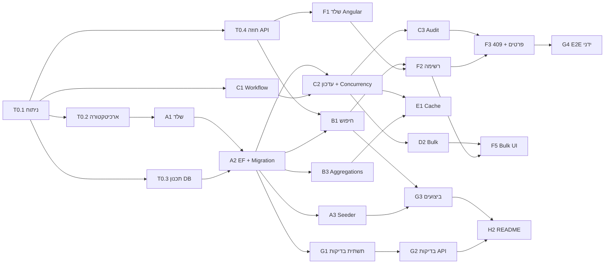

# תכנון עבודה וחלוקה למשימות

המסמך מתאר איך האפיון פורק ליחידות עבודה לפני הפיתוח: דרישות ← Features ← Tasks, עם תוצר מצופה, תלויות, סדר ביצוע והערכת מאמץ.
הערכות המאמץ הן בשעות עבודה נטו של מפתח/ת אחד/ת.

## 1. דרישות המבדק (מזהים לשימוש בהמשך)

| מזהה | דרישה (מהאפיון) |
|---|---|
| R1 | שליפת נתונים: Pagination, סינון משולב, חיפוש טקסט, מיון, Aggregations, Validation, CancellationToken, DTOs |
| R2 | עדכון סטטוס: 404, Validation, מעברים מותרים, Optimistic Concurrency, UpdatedAt/RowVersion, מניעת Lost Update |
| R3 | היסטוריית שינויים (Audit) + Endpoint |
| R4 | פעולת Bulk עד 100 פניות + הגדרת התנהגות בכשל חלקי |
| R5 | Angular: פעולות בצד השרת, Debounce, ביטול בקשות, מצבי Loading/Empty/Error, טיפול ב-409, Aggregations, היסטוריה, הפרדת אחריות |
| R6 | ביצועים: מדידה על 100K, Plan, אינדקסים, Bottleneck |
| R7 | Cache: Expiration, Invalidation, נימוק, ריבוי מופעים |
| R8 | בדיקות אוטומטיות (≥4, כולל Integration ו-Concurrency) |
| R9 | תכנון עבודה (המסמך הזה) |
| R10 | איכות קוד: מבנה, DI, Async, Error handling, Validation, Logging |
| R11 | תיעוד |
| D | נתוני בדיקה: ≥100K רשומות, יצירה חוזרת |

## 2. החלטות שנדרשו לפני תחילת הפיתוח

| החלטה | אפשרויות | נבחר | הערה |
|---|---|---|---|
| בסיס נתונים | SQL Server / MongoDB | SQL Server | `rowversion` מובנה ל-Concurrency, Execution Plans למדידה |
| התנהגות Bulk | All-or-Nothing / Partial Success | Partial Success | נימוק ב-README |
| מעברי סטטוס | חופשי / Workflow מוגדר | Workflow מוגדר | `StatusTransitions` – מקור אמת אחד, מוחזר ל-UI |
| זיהוי המשתמש (`ChangedBy`) | אימות מלא / שדה בבקשה | שדה בבקשה | אין אימות באפיון; מגבלה מתועדת |

## 3. פירוק למשימות

עמודות: **מזהה** · **משימה** · **מה נדרש** · **תוצר מצופה** · **תלוי ב-** · **הערכה (שעות)** · **דרישה**

### Epic 0 – ניתוח ותכנון

| מזהה | משימה | מה נדרש | תוצר | תלוי ב- | הערכה | דרישה |
|---|---|---|---|---|---|---|
| T0.1 | ניתוח האפיון | מיפוי כל הדרישות, זיהוי שאלות פתוחות והחלטות (טבלה 2) | רשימת דרישות R1–R11 + החלטות | – | 1 | R9 |
| T0.2 | ארכיטקטורה והחלטות טכנולוגיות | מבנה Solution, שכבות, גרסאות, אסטרטגיית Concurrency ו-Cache | סעיף "החלטות" ב-README | T0.1 | 1 | R10, R11 |
| T0.3 | תכנון בסיס הנתונים | טבלאות, טיפוסים, אינדקסים לפי תרחישי השאילתות | מודל + רשימת אינדקסים מנומקת | T0.1 | 1.5 | R1, R6 |
| T0.4 | תכנון חוזה ה-API | Endpoints, פרמטרים, DTOs, קודי HTTP, מבנה תשובת Bulk | טבלת API ב-README | T0.1 | 1 | R1, R2, R4 |

### Epic A – תשתית

| מזהה | משימה | מה נדרש | תוצר | תלוי ב- | הערכה | דרישה |
|---|---|---|---|---|---|---|
| A1 | שלד הפתרון | Web API + פרויקט בדיקות, DI, ProblemDetails, Global Exception Handler, Swagger, `nuget.config` | Solution שנבנה ורץ | T0.2 | 1.5 | R10 |
| A2 | מודל EF Core + Migration | ישויות, Configurations, rowversion, אינדקסים, UTC | Migration ראשונה | T0.3, A1 | 1.5 | R1, R2 |
| A3 | Seeder ליצירה חוזרת | 100K רשומות דטרמיניסטיות ב-SqlBulkCopy, פקודת `seed` | `dotnet run -- seed` | A2 | 1.5 | D |

### Epic B – שליפת נתונים (R1)

| מזהה | משימה | מה נדרש | תוצר | תלוי ב- | הערכה | דרישה |
|---|---|---|---|---|---|---|
| B1 | Endpoint חיפוש | סינון משולב, טקסט, מיון 6 שדות Asc/Desc, Paging, הגבלת PageSize, Validation, CancellationToken, Projection ל-DTO | `GET /api/requests` | A2, T0.4 | 3 | R1 |
| B2 | פנייה בודדת | DTO עם `allowedNextStatuses` | `GET /api/requests/{id}` | A2 | 0.5 | R1, R5 |
| B3 | Aggregations | ספירה לפי סטטוס, פתוחות לפי עדיפות, Top מטפלים | `GET /api/requests/summary` | A2 | 1.5 | R1 |

### Epic C – עדכון סטטוס, תחרותיות והיסטוריה (R2, R3)

| מזהה | משימה | מה נדרש | תוצר | תלוי ב- | הערכה | דרישה |
|---|---|---|---|---|---|---|
| C1 | Workflow סטטוסים | טבלת מעברים, `ChangeStatus` בישות שמחזיר רשומת Audit | Domain + בדיקות יחידה | T0.1 | 1 | R2 |
| C2 | עדכון עם Optimistic Concurrency | rowversion מהלקוח כ-OriginalValue, 404/409/422, UpdatedAt | `PATCH /api/requests/{id}/status` | C1, A2 | 2 | R2 |
| C3 | Audit + Endpoint היסטוריה | כתיבה באותה טרנזקציה, שליפה ממוינת | `GET /api/requests/{id}/history` | C2 | 1.5 | R3 |

### Epic D – Bulk (R4)

| מזהה | משימה | מה נדרש | תוצר | תלוי ב- | הערכה | דרישה |
|---|---|---|---|---|---|---|
| D1 | הגדרת התנהגות | Partial Success, תוצאה לכל פריט, מגבלת 100, כפילויות | חוזה תשובה מתועד | T0.4 | 0.5 | R4 |
| D2 | מימוש | טעינה בשאילתה אחת, ולידציה לכל פריט, שמירה בטרנזקציה אחת, בידוד Conflict ונסיון חוזר | `POST /api/requests/bulk/status` | C2, D1 | 2 | R4 |

### Epic E – Cache (R7)

| מזהה | משימה | מה נדרש | תוצר | תלוי ב- | הערכה | דרישה |
|---|---|---|---|---|---|---|
| E1 | Cache ל-Summary | TTL מוגדר, Invalidation בכל עדכון, טיפול ב-race בין חישוב לעדכון | `SummaryCache` | B3, C2 | 1.5 | R7 |

### Epic F – Angular (R5)

| מזהה | משימה | מה נדרש | תוצר | תלוי ב- | הערכה | דרישה |
|---|---|---|---|---|---|---|
| F1 | שלד + שכבת API | פרויקט, Proxy, Models, `RequestsApi` | שירות HTTP | T0.4 | 1.5 | R5 |
| F2 | רשימה | Store עם `switchMap`, טופס סינון עם Debounce, טבלה עם מיון, Pagination, Loading/Empty/Error | מסך רשימה | F1, B1 | 4 | R5 |
| F3 | פרטים ועדכון | פאנל פרטים, שינוי סטטוס, הודעת 409 וטעינה מחדש, היסטוריה | פאנל פרטים | F2, C3 | 2.5 | R5 |
| F4 | Aggregations | כרטיסי סיכום, רענון אחרי עדכון | פאנל סיכום | F1, B3 | 1 | R5 |
| F5 | Bulk UI | בחירת שורות, פעולה, הצגת תוצאה לכל פריט | סרגל Bulk | F2, D2 | 1.5 | R4, R5 |
| F6 | בדיקות Frontend | ביטול בקשה קודמת, איפוס עמוד, מצב שגיאה | `requests-list.store.spec.ts` | F2 | 1 | R5, R8 |

### Epic G – איכות וביצועים

| מזהה | משימה | מה נדרש | תוצר | תלוי ב- | הערכה | דרישה |
|---|---|---|---|---|---|---|
| G1 | תשתית Integration Tests | `WebApplicationFactory` מול SQL Server אמיתי, DB נפרד, איפוס בין בדיקות | `RequestsApiFactory` | A2 | 1.5 | R8 |
| G2 | בדיקות API | חיפוש, Validation, עדכון, Concurrency מקבילי, Bulk, Invalidation | 33 בדיקות | G1, B1, C3, D2, E1 | 3 | R8 |
| G3 | מדידת ביצועים | לכידת SQL מ-EF, STATISTICS IO/TIME/PROFILE, השוואה עם/בלי אינדקס, ניסוי שיפור | `docs/PERFORMANCE.md`, `measure.sql` | A3, B1, B3 | 2.5 | R6 |
| G4 | בדיקת קצה-לקצה ידנית | מעבר על כל התרחישים בדפדפן, כולל Conflict ו-Bulk | רשימת ממצאים ותיקונים | F3, F5 | 1 | R5 |

### Epic H – תיעוד והגשה

| מזהה | משימה | מה נדרש | תוצר | תלוי ב- | הערכה | דרישה |
|---|---|---|---|---|---|---|
| H1 | תוכנית עבודה | המסמך הזה | `docs/WORK_PLAN.md` | T0.1 | 1.5 | R9 |
| H2 | README ותיעוד | הרצה, גרסאות, מבנה, DB, Concurrency, Bulk, Cache, החלטות, מגבלות, AI | `README.md` | כל השאר | 2.5 | R11 |
| H3 | הכנה להרצה והגשה | בדיקה מ-Clone נקי, Repository, הוראות | Repository נגיש | H2 | 1 | R11 |

## 4. סיכום מאמץ

| Epic | שעות |
|---|---|
| 0 – ניתוח ותכנון | 4.5 |
| A – תשתית | 4.5 |
| B – שליפה | 5 |
| C – עדכון, Concurrency, Audit | 4.5 |
| D – Bulk | 2.5 |
| E – Cache | 1.5 |
| F – Angular | 11.5 |
| G – בדיקות וביצועים | 8 |
| H – תיעוד והגשה | 5 |
| **סה"כ** | **47 שעות (~6 ימי עבודה)** |

## 5. סדר ביצוע ותלויות

**סדר העבודה בפועל (Iterations):**

1. **תכנון** – T0.1–T0.4, H1 (טיוטה).
2. **Backend core** – A1 → A2 → A3, ובמקביל C1 (לוגיקת Domain ללא תלות ב-DB).
3. **API** – B1, B2, B3 → C2 → C3 → D2 → E1. בדיקות G1/G2 נכתבות יחד עם כל Endpoint (ולא בסוף).
4. **Frontend** – F1 → F2 → F3/F4/F5 → F6. אפשר להתחיל F1 מיד אחרי T0.4 (חוזה API ידוע).
5. **ביצועים** – G3 על 100K רשומות, עדכון אינדקסים לפי הממצאים.
6. **סגירה** – G4, H2, H3.

**הנתיב הקריטי:** T0.1 → T0.3 → A2 → C2 → D2 → F5 → G4 → H2.

## 6. מה התגלה במהלך העבודה (פער בין תכנון לביצוע)

* **בדיקות Integration תפסו באגים אמיתיים**: `UpdatedAt` שהוחזר ללקוח היה בדיוק גבוה מזה שנשמר ב-`datetime2(3)`; תאריכים הוחזרו בלי `Z` (UTC). שניהם תוקנו.
* **Seeder**: `DBCC CHECKIDENT RESEED 0` על טבלה חדשה יצר `Id = 0` – תוקן לבצע Reseed רק אם כבר נוספו שורות בעבר.
* **ביצועים**: המדידה הראתה שחיפוש הטקסט הוא צוואר הבקבוק (CPU של Collation, לא IO) – נוסף ניסוי ושיפור מוצע.
* **סביבה**: Angular 22 דורש Node ‎22.22.3+; נבחר Angular 21 שנתמך בגרסת ה-Node הקיימת.
