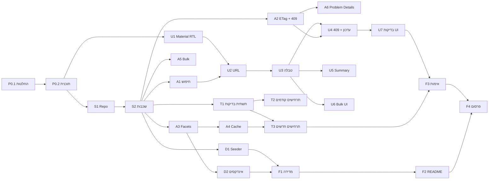

# תכנון עבודה וחלוקה למשימות

## רקע – איך נוצרה התוכנית

* **גרסה 1** של הפתרון פותחה ישירות מהאפיון, ונכתבה לה תוכנית עבודה בדיעבד.
* בסקירה של גרסה 1 זוהו החלטות שהתקבלו בלי דיון (מבנה הפרויקט, אופן העברת הגרסה, ממשק באנגלית ועוד). כל החלטה נבחנה מחדש אחת-אחת, מול דרישות האפיון.
* **המסמך הזה נכתב לפני תחילת העבודה על גרסה 2**, והוא התוכנית שלפיה היא מבוצעת. כל משימה = Commit נפרד, כך שהיסטוריית ה-Git משקפת את סדר הביצוע.

הערכות המאמץ הן בשעות עבודה נטו, בהתחשב בכך שחלק מהקוד קיים מגרסה 1.

## 1. דרישות המבדק (מזהים)

| מזהה | דרישה |
|---|---|
| R1 | שליפה: Pagination, סינון משולב, חיפוש טקסט, מיון, Aggregations, Validation, CancellationToken, DTOs |
| R2 | עדכון סטטוס: 404, Validation, מעברים מותרים, Optimistic Concurrency, UpdatedAt/RowVersion, מניעת Lost Update |
| R3 | היסטוריית שינויים (Audit) + Endpoint |
| R4 | Bulk עד 100 פניות + התנהגות בכשל חלקי |
| R5 | Angular: פעולות בצד השרת, Debounce, ביטול בקשות, Loading/Empty/Error, 409, Aggregations, היסטוריה, הפרדת אחריות |
| R6 | ביצועים על 100K: Plan, אינדקסים, Bottleneck |
| R7 | Cache: Expiration, Invalidation, נימוק, ריבוי מופעים |
| R8 | ≥4 בדיקות אוטומטיות, כולל Integration ו-Concurrency |
| R9 | תכנון עבודה |
| R10 | איכות קוד: מבנה, DI, Async, שגיאות, Validation, Logging |
| R11 | תיעוד |
| D | ≥100K רשומות, יצירה חוזרת |

## 2. החלטות לגרסה 2

| # | נושא | החלטה | נימוק |
|---|---|---|---|
| 1 | מבנה | 3 פרויקטים: Api / Application / Infrastructure + שכבת Services ב-Application | הקומפיילר אוכף את כיוון התלויות; ה-Services מחזיקים את הלוגיקה (מעברים, Audit, Bulk, Cache) כך שה-Repository נשאר גישה לנתונים בלבד |
| 2 | העברת גרסה | עדכון בודד: `ETag` + `If-Match` (חסר → 428, `*`/פגום → 400). Bulk: `rowVersion` לכל פריט בגוף | `If-Match` הוא המנגנון הסטנדרטי של HTTP לעדכון מותנה; ב-Bulk Header אחד לא יכול לשאת 100 גרסאות |
| 3 | 409 | גוף עם `currentState` + `lastChange` (מי ומתי, מה-Audit); דיאלוג "רענון" / "ניסיון חוזר" | 409 עם המצב הנוכחי חוסך ללקוח בקשה נוספת; ה-Audit מאפשר לומר גם מי שינה. ההחלטה מי מנצח נשארת אצל המשתמש |
| 4 | מעברי סטטוס | Workflow: New→InProgress/Waiting, InProgress→Waiting/Completed, Waiting→InProgress/Completed, Completed→InProgress | האפיון דורש "מעבר שאינו מותר" |
| 5 | Summary | Facets לפי הפילטר הנוכחי; Cache רק לתצוגה ללא פילטר. שדות: סה"כ, לפי סטטוס, לפי עדיפות, פתוחות מעל 7 ימים, עדכון אחרון, Top מטפלים | ספירה לפי שאר הפילטרים עונה על "מה יש בקטגוריות האחרות"; התצוגה ללא פילטר היא הנפוצה והיקרה ביותר ולכן היא שנשמרת ב-Cache |
| 6 | ממשק | עברית RTL + Angular Material; נתונים בעברית | קהל היעד דובר עברית; Material נותן רכיבים נגישים מוכנים (טבלה, דפדוף, דיאלוגים) |
| 7 | מצב סינון | מסונכרן ל-URL | רענון שומר את התצוגה, אפשר לשתף קישור, כפתור Back עובד |
| 8 | נתוני בדיקה | Seed אוטומטי בהרצה ראשונה + פקודת `seed` ליצירה חוזרת; Bogus עם Seed קבוע + SqlBulkCopy | הבודק לא צריך פקודה נוספת בהרצה ראשונה; האפיון דורש יצירה חוזרת |
| 9 | גרסאות | .NET 8 + EF Core 8; Angular 21 | נגישות לבודקים; Node הקיים |
| 10 | בדיקות | DB נפרד לכל מחלקת בדיקות; FluentAssertions 7 (נעול); תרחישי קצה בדפדוף, בחיפוש ובעדכון + Bulk/Audit/Cache | בידוד מלא והרצה מקבילית; Migration אמיתי נבדק; גרסה 8+ של FluentAssertions דורשת רישיון בתשלום |
| 11 | Repo | `src/` + `tests/`; `Directory.Build.props`, `.editorconfig`, `.gitattributes`, `nuget.config` | מבנה מקובל ב-.NET; הגדרות משותפות במקום אחד; סיומי שורה עקביים |

### החלטות שהתקבלו במהלך הביצוע

שאלות שעלו רק בזמן העבודה, ונבחנו לפני שהמשכנו:

| משימה | נושא | החלטה | נימוק |
|---|---|---|---|
| S1 | כלל CA1848 (Logging) | `[LoggerMessage]` Source Generator | ללא boxing כשהרמה כבויה, נבדק בקומפילציה, רשימת אירועי לוג מרוכזת |
| S2 | מה ה-Repository מחזיר בקריאה | DTOs שמוטלים (Projection) בתוך ה-DB | Application לא תלוי ב-EF בכלל; סינון/מיון/דפדוף תמיד ב-SQL |
| D1 | שמות ארגונים | בדויים, מורכבים מחלקים | לא לייחס פניות/תלונות מומצאות לגופים אמיתיים |
| D1 | שמות מטפלים | שמות עבריים בדויים | טבעי בממשק בעברית |
| U3 | סינון לפי מטפל | חיפוש טקסט `contains` (שם פרטי או משפחה) | נוח למשתמש; העלות (Scan על אינדקס צר במקום Seek) נמדדת ב-F1 |
| U4 | הצגת פרטי פנייה | פאנל צד, מזהה הפנייה ב-URL | הרשימה נשארת גלויה; רענון/קישור/Back פותחים את אותה פנייה |

## 3. משימות

עמודות: **מזהה** · **משימה** · **מה נדרש** · **תוצר** · **תלוי ב-** · **שעות** · **דרישה**

### Epic 0 – תכנון

| מזהה | משימה | מה נדרש | תוצר | תלוי ב- | שעות | דרישה |
|---|---|---|---|---|---|---|
| P0.1 | סקירת החלטות | מעבר על החלטות גרסה 1 מול האפיון | טבלת החלטות (סעיף 2) | – | 2 | R9, R11 |
| P0.2 | תוכנית עבודה | המסמך הזה | `docs/WORK_PLAN.md` | P0.1 | 1 | R9 |

### Epic 1 – מבנה ותשתית

| מזהה | משימה | מה נדרש | תוצר | תלוי ב- | שעות | דרישה |
|---|---|---|---|---|---|---|
| S1 | Repo ותצורה | מעבר ל-`src/`+`tests/`, `Directory.Build.props` (.NET 8, Analyzers, Warnings as errors), `.editorconfig`, `.gitattributes` + נרמול שורות | Repo נבנה ב-.NET 8 | P0.2 | 1 | R10 |
| S2 | פיצול לשכבות | Application (ישויות, Workflow, DTOs, `IRequestRepository`, Services, Exceptions), Infrastructure (DbContext, Configurations, Repository, Migrations, Seeder, `AddInfrastructure()`), Api (Controllers, Error handling); Migration חדש ל-EF 8; תיקון התלות DTO→Persistence | 3 פרויקטים, כיוון תלויות נאכף ע"י הקומפיילר | S1 | 3 | R10 |

### Epic 2 – נתונים

| מזהה | משימה | מה נדרש | תוצר | תלוי ב- | שעות | דרישה |
|---|---|---|---|---|---|---|
| D1 | Seeder | Bogus עם Seed קבוע, נתונים בעברית, SqlBulkCopy, Seed אוטומטי כשהטבלה ריקה, פקודת `seed [count]` | 100K רשומות זהות בכל הרצה | S2 | 2 | D |
| D2 | אינדקסים ל-Summary | בדיקה אם ה-Facets החדשים (פתוחות מעל 7 ימים, עדכון אחרון) צריכים INCLUDE נוסף; Migration אם נדרש | אינדקסים מעודכנים | A3 | 1 | R6 |

### Epic 3 – API

| מזהה | משימה | מה נדרש | תוצר | תלוי ב- | שעות | דרישה |
|---|---|---|---|---|---|---|
| A1 | חיפוש | העברה לשכבות; Offset בטוח מגלישה; עמוד מעבר לסוף מחזיר ריק | `GET /api/requests` | S2 | 1 | R1 |
| A2 | עדכון בודד עם ETag | `ETag` ב-GET/PATCH, `If-Match` חובה (428/400), 409 עם `currentState` + `lastChange` | `PATCH /api/requests/{id}/status` | S2 | 2.5 | R2, R3 |
| A3 | Summary כ-Facets | `GROUP BY` אחד עם הפילטרים; `byStatus` מתעלם מפילטר הסטטוס, `byPriority` מפילטר העדיפות; Top מטפלים | `GET /api/requests/summary` | S2 | 2 | R1 |
| A4 | Cache | Cache רק לתצוגה ללא פילטר; TTL; Invalidation בעדכון (בודד ו-Bulk); טוקן נגד race | `SummaryCache` | A3 | 1 | R7 |
| A5 | Bulk | העברה ל-Service; אותה התנהגות (Partial Success) | `POST /api/requests/bulk/status` | S2 | 1 | R4 |
| A6 | עקביות Problem Details | Enum כמחרוזת גם בגוף Problem Details (`currentState`) | תשובות שגיאה עקביות | A2 | 0.5 | R10 |

### Epic 4 – Angular

| מזהה | משימה | מה נדרש | תוצר | תלוי ב- | שעות | דרישה |
|---|---|---|---|---|---|---|
| U1 | Material + RTL | התקנת Angular Material 21, `dir="rtl"`, תוויות עבריות, Paginator בעברית | בסיס UI | P0.2 | 2 | R5 |
| U2 | מצב ב-URL | Store קורא/כותב Query Params; Debounce + `switchMap` נשמרים | רענון/קישור/Back עובדים | U1, A1 | 2 | R5 |
| U3 | טבלה וסינון | Material Table + Sort + Paginator, טופס סינון, Loading/Empty/Error | מסך רשימה | U2 | 3 | R5 |
| U4 | עדכון + 409 | שליחת `If-Match`; דיאלוג Conflict (מי/מתי/מה ניסית; רענון / ניסיון חוזר רק אם המעבר עדיין מותר); היסטוריה | פאנל פרטים + דיאלוגים | U3, A2 | 3 | R2, R5 |
| U5 | Summary | כרטיסי Facets עם הערה כשפילטר פעיל | פאנל סיכום | U3, A3 | 1.5 | R5 |
| U6 | Bulk UI | בחירת שורות, פעולה, תוצאה לכל פריט | סרגל Bulk | U3, A5 | 1 | R4, R5 |
| U7 | בדיקות Frontend | סנכרון URL, ביטול בקשה, טיפול ב-409 | Specs | U4 | 1.5 | R5, R8 |

### Epic 5 – בדיקות Backend

| מזהה | משימה | מה נדרש | תוצר | תלוי ב- | שעות | דרישה |
|---|---|---|---|---|---|---|
| T1 | תשתית | Factory עם DB ייחודי לכל מחלקה (Migration אמיתי, נמחק בסוף); FluentAssertions 7 | `RequestsApiFactory` | S2 | 1.5 | R8 |
| T2 | תרחישי קצה | שוויון ערכי מיון בדפדוף, עמוד מעבר לסוף, גלישת int, `%` בחיפוש, Summary = סה"כ הרשימה, 409 לא דורס (קריאה ישירה מה-DB), ניסיון חוזר עם הגרסה מה-409, מקרי `If-Match` | בדיקות | T1, A1, A2, A3 | 2.5 | R8 |
| T3 | תרחישים חדשים | Bulk (תוצאות מעורבות, 100, כפילויות), Audit, Cache Invalidation, מעברים, Facets | בדיקות | T1, A4, A5 | 1.5 | R8 |

### Epic 6 – ביצועים, תיעוד והגשה

| מזהה | משימה | מה נדרש | תוצר | תלוי ב- | שעות | דרישה |
|---|---|---|---|---|---|---|
| F1 | מדידה מחדש | SQL של EF 8, שאילתת ה-Summary החדשה, עם/בלי אינדקסים | `docs/PERFORMANCE.md`, `measure.sql` | D1, D2, A1, A3 | 2 | R6 |
| F2 | README | עדכון לכל ההחלטות; סעיף AI עם מקום להערות הבדיקה שלי | `README.md` | כל המשימות | 2.5 | R11 |
| F3 | אימות | Clone נקי, בדיקה ידנית בדפדפן של כל התרחישים | רשימת ממצאים | U7, T3, F1 | 1.5 | R5, R11 |
| F4 | פרסום | Push ל-GitHub – רק אחרי שסעיף ה-AI הושלם | Repository | F2, F3, Epic 7 | 0.5 | R11 |

### Epic 7 – שיפור חוויית המשתמש (נוסף אחרי סקירה של המסך)

בסקירה של המסך הגמור עלו שלוש בעיות: המסך עמוס (הסיכום תופס שליש מהגובה, רק 5 שורות בטבלה גלויות), שדות הסינון לא פרופורציונליים (חמישה שדות גבוהים באותו גודל, תאריכים בפורמט אמריקאי), והודעות השגיאה כלליות מדי. השינויים נבחרו אחד-אחד לפני הביצוע.

| מזהה | משימה | מה נדרש | תוצר | תלוי ב- | שעות | דרישה |
|---|---|---|---|---|---|---|
| X1 | פריסה | רצועת סיכום דקה (סה"כ, פתוחות מעל 7 ימים, ספירה לכל סטטוס שלחיצה עליה מסננת) + פילוחים בפאנל מתקפל; פרטי פנייה במגירה מעל הטבלה במקום לכווץ אותה; טבלה דחוסה (כותרת בשורה אחת עם "…", תאריך קצר) | מסך שבו הטבלה מתחילה גבוה ושומרת על רוחבה | U7 | 3 | R5 |
| X2 | חיפוש וסינון | שדה חיפוש בולט אחד (אייקון, ניקוי ✕); "סינון מתקדם" מתקפל עם מונה; בורר טווח תאריכים של Material בעברית (dd/MM/yyyy); צ'יפים של הסינונים הפעילים עם הסרה ו"ניקוי הכול" | טופס סינון מסודר | X1 | 3 | R5 |
| X3 | הודעות | הודעות ספציפיות מנתוני השרת (422: מעברים מותרים, 400: איזה שדה ולמה, 404: מזהה הפנייה, 500: קוד לפנייה לתמיכה); שגיאות ליד השדה; באנר "אין חיבור לשרת" עם ניסיון חוזר | הודעות שאומרות מה קרה ומה לעשות | X1 | 2.5 | R5, R10 |
| X4 | בדיקות ואימות | עדכון בדיקות הלקוח (מיפוי הודעות, צ'יפים פעילים, לחיצה על סטטוס ברצועה), בדיקה בדפדפן בגודל מחשב נייד | בדיקות עוברות + צילומי מסך | X1–X3 | 1.5 | R5, R8 |

## 4. סיכום מאמץ

| Epic | שעות |
|---|---|
| 0 – תכנון | 3 |
| 1 – מבנה ותשתית | 4 |
| 2 – נתונים | 3 |
| 3 – API | 8 |
| 4 – Angular | 14 |
| 5 – בדיקות Backend | 5.5 |
| 6 – ביצועים, תיעוד והגשה | 6.5 |
| 7 – שיפור חוויית המשתמש | 10 |
| **סה"כ** | **54** |

## 5. סדר ביצוע ותלויות

**סדר הביצוע:**

1. **תכנון:** P0.1, P0.2.
2. **בסיס:** S1 → S2. כל השאר תלוי בפיצול לשכבות, ולכן הוא ראשון.
3. **Backend:** D1, A1, A2, A3, A5 (בלתי תלויים זה בזה) → A4, A6, D2. בדיקות T1–T3 נכתבות יחד עם כל Endpoint ולא בסוף.
4. **Frontend:** U1 יכול להתחיל במקביל ל-S2. אחריו U2 → U3 → U4/U5/U6 → U7.
5. **סגירה:** F1 → F2 → F3 → F4.

**הנתיב הקריטי:** P0.2 → S1 → S2 → A2 → U4 → U7 → F3 → F4.

**סיכונים:**
* **S2** הוא השינוי הגדול ביותר: הזזת כל הקבצים ו-Migration חדש. בדיקות גרסה 1 (33) הן רשת הביטחון, והן חייבות לעבור לפני שממשיכים.
* **U1:** מעבר ל-Material ול-RTL עלול לשבור עיצוב; בדיקה ידנית בסוף U3.
